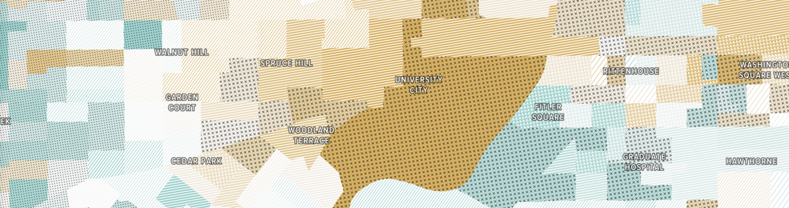

# Texturemap
SVG textures and patterns for use in Mapbox GL JS and other maps.

## How to use

### Mapbox GL JS

#### Mapbox Studio
1. Open a project in Mapbox Studio
2. Open "Images" tab from header
3. Upload images from `/patterns`
4. These images should now be available as patterns for `fill` features

#### Mapbox GL, Without Mapbox Studio
If you are not using Mapbox Studio for your Mapbox GL JS project, you will need to convert these SVGs into a sprite using [spritezero](https://github.com/mapbox/spritezero) or a similar tool.
