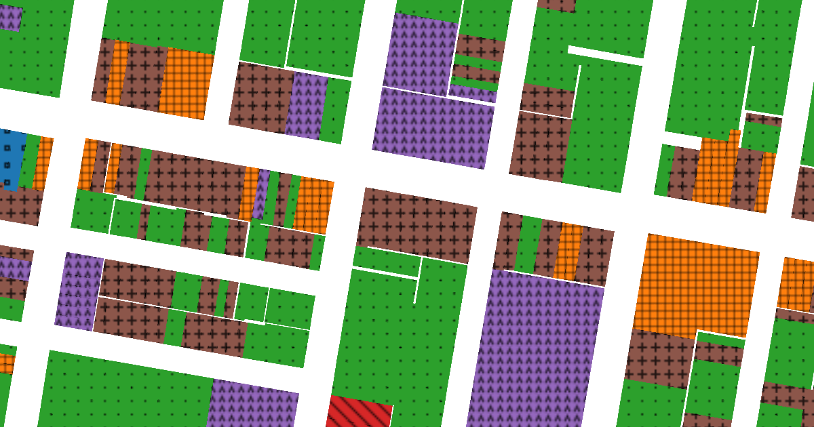

# TextureMap

Textures, patterns, and shapes that make web maps work for people with color vision deficiency. Built for Mapbox GL and MapLibre GL.



## How to use

### Polygons

[Example of polygons](examples/polygons)

TextureMap polygons use the Mapbox `fill-pattern` property to add a pattern layer to the map. If your polygon style includes color and pattern, each of those properties will be handled by a separate layer. In other words, you will have one layer for `fill-color` beneath a second layer for `fill-pattern`. If you want to allow your user to toggle the pattern on and off, you can set the `visibility` to `none` for the pattern layer.

#### Mapbox Studio

1. Open a project in Mapbox Studio
2. Open the "Images" tab from header
3. Switch to the "Custom" tab
4. Upload images from [`dist/polygons`](`dist/polygons`)
5. Create or edit a fill (polygons) or symbol (points) layer
6. Set the "Pattern" property to an image from TextureMap

#### Mapbox GL (without Mapbox Studio) or MapLibre GL

If you are working directly with the Mapbox GL or MapLibre libraries, you will need the TextureMap images as a [sprite](https://docs.mapbox.com/help/glossary/sprite/). You can download these from [`dist/sprites`](`dist/sprites`) or generate them yourself using [spritezero](https://github.com/mapbox/spritezero). See [`examples/points`](`examples/points`) for an example project using a sprite.

### Lines

[Example of lines](examples/lines)

TextureMap lines are trickier to implement than the other geometry types. To achieve unique line styles, TextureMap builds compound lines using several overlapping lines. For example, the "railroad style" lines -`|-|-|-` are constructed from 1.) a thin line as the base; 2.) a thick line with a dash array for the perpendicular lines.

Here is what the Mapbox style definition looks like for the example described above:

```js
// Thin base line
{
  id: "line7-a",
  type: "line",
  source: "lines",
  filter: ["match", ["get", "type"], 7, true, false],
  layout: { "line-miter-limit": 0 },
  paint: { "line-color": "#8c564b", "line-width": 3 }
}
// Thick line with dash array for the perpendicular lines
{
  id: "line7-b",
  type: "line",
  source: "lines",
  filter: ["match", ["get", "type"], 7, true, false],
  layout: { "line-miter-limit": 0 },
  paint: {
    "line-color": "#8c564b",
    "line-dasharray": [0.15, 0.4],
    "line-width": 11
  }
}
```

See [`examples/lines/js/main.js`](examples/lines/js/main.js) for a full list of the line styles used in TextureMap.

### Points

[Example of points](examples/points)

TextureMap points use the Mapbox `icon-image` property on a `symbol` layer.

#### Mapbox Studio

1. Open a project in Mapbox Studio
2. Open the "Images" tab from header
3. Switch to the "Custom" tab
4. Upload images from [`dist/points`](`dist/points`)
5. Create or edit a symbol layer
6. Under the "Icon" tab, set the "Image" property to a image from TextureMap

#### Mapbox GL (without Mapbox Studio) or MapLibre GL

If you are working directly with the Mapbox GL or MapLibre libraries, you will need the TextureMap images as a [sprite](https://docs.mapbox.com/help/glossary/sprite/). You can download these from [`dist/sprites`](`dist/sprites`) or generate them yourself using [spritezero](https://github.com/mapbox/spritezero). See [`examples/points`](`examples/points`) for an example project using a sprite.

## Best Practices

### Use for categorical data

TextureMap is designed for [categorical](http://www.stat.yale.edu/Courses/1997-98/101/catdat.htm) data. Examples of categorical data would be **types of schools** (public, private, charter) and **political party representation** (Democratic, Republican). Use "colorblind safe" color schemes for [sequential](https://colorbrewer2.org/#type=sequential&scheme=BuGn&n=3) and [diverging](https://colorbrewer2.org/#type=diverging&scheme=BrBG&n=3) data.

### Aim for variety

To the extent possible, use shapes that are visually distinct. Good: a circle, triangle, and square look relatively different. Bad: a pentagon, hexagon, and octagon look relatively similar.

### Test your designs

If you are not colorblind (color vision deficient), use simulation tools such as [Sim Daltonism](https://michelf.ca/projects/sim-daltonism/) to test your designs. Consider hiring a consultant to review your work.

### Default or toggle

TextureMap can work well as a default style or as a toggleable setting.

### Bigger accessibility issues

TextureMap can improve accessibility for colorblind users. But even the best designed map can be an accessibility nightmare for screen reader users, users who don't use a mouse, etc. For a truly accessible experience, provide an alternative to maps. Offer data as tables, lists, and text. Design workflows that don’t depend on a map to get to the next step. Ask: if the map disappeared, could a user complete their task?

## Thank you

- [Robert Noorda](http://robertnoorda.com/portfolio/colorblind-consulting/) for colorblind consulting
- Scott Lederer for feedback on initial concept and website
- Alex Lash for feedback on initial concept and website
